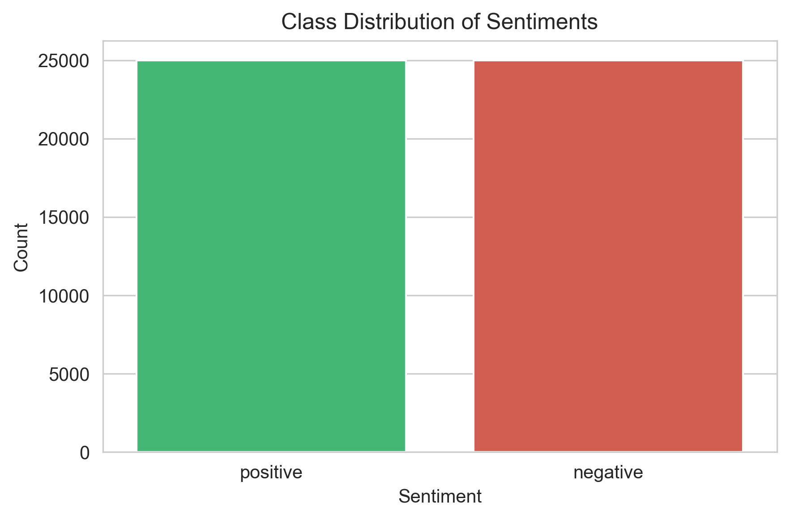
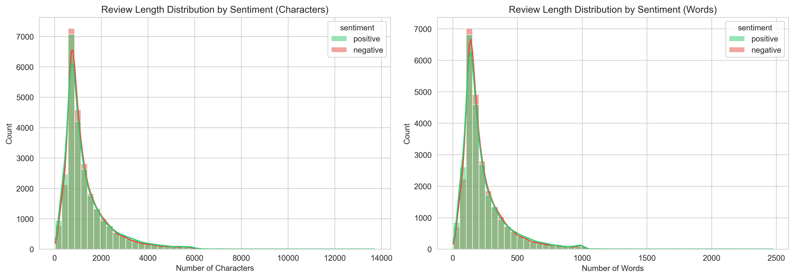
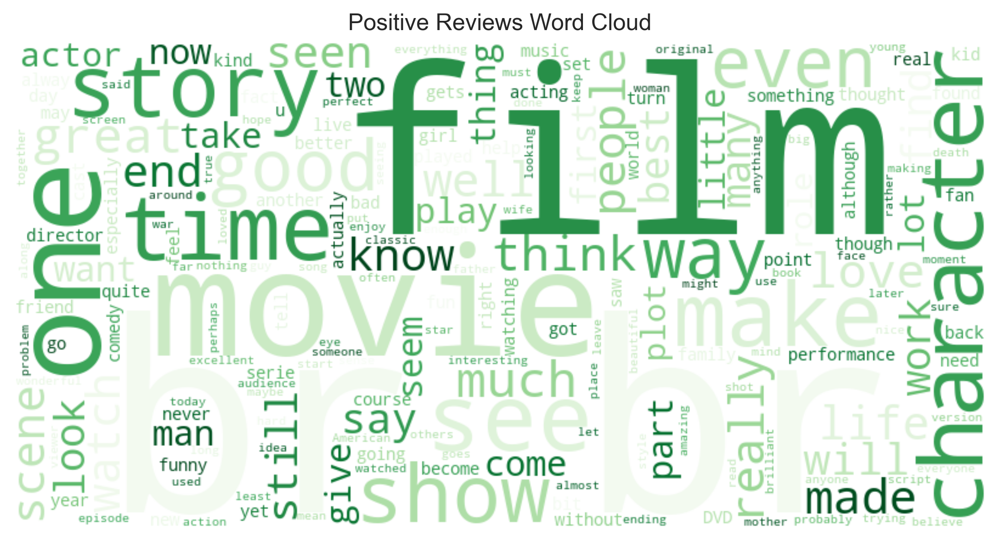
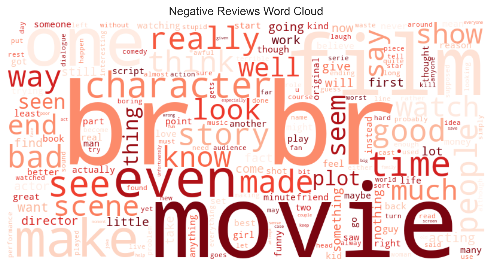
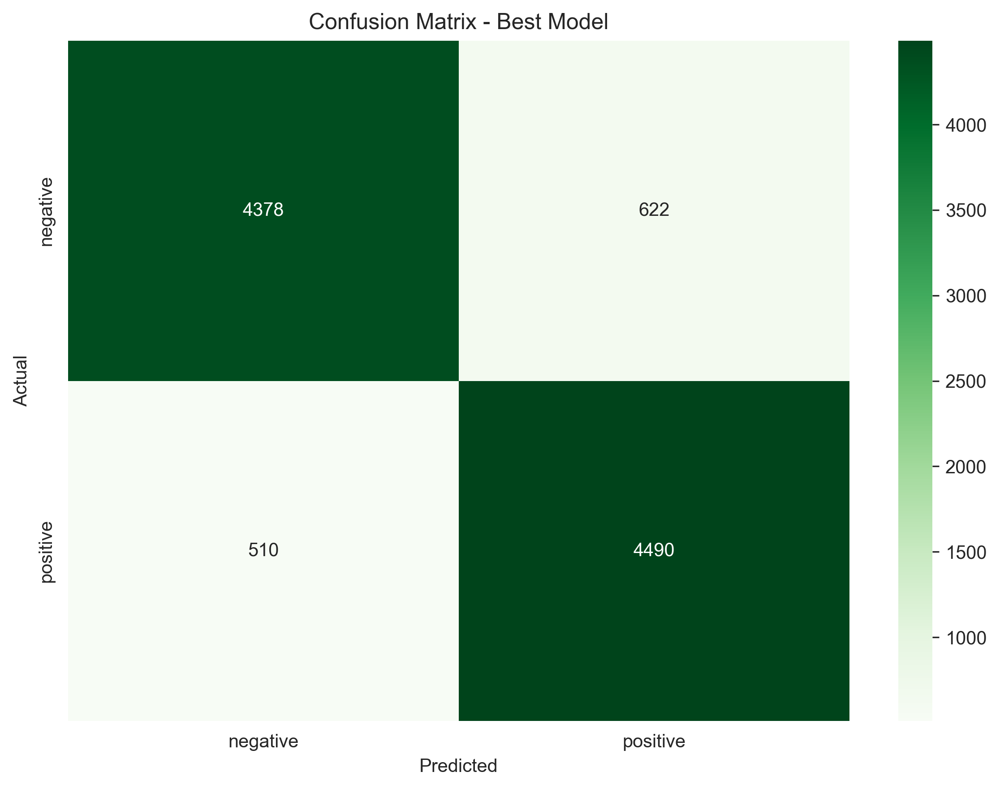

```markdown
# Project 06 — Sentiment Analysis (NLP)

[](https://www.python.org/downloads/)
[](https://scikit-learn.org/)
[](https://streamlit.io/)
[](https://opensource.org/licenses/MIT)

A complete end‑to‑end sentiment analysis project using **TF‑IDF** and **Logistic Regression**. The model is trained on 50,000 IMDB movie reviews and achieves an **F1 score of ~0.89** on the test set. The project includes exploratory data analysis, text preprocessing, hyperparameter tuning, model evaluation, and an interactive **Streamlit** web app.

---

## 📌 Table of Contents
- [Dataset](#dataset)
- [Project Structure](#project-structure)
- [Installation](#installation)
- [Usage](#usage)
  - [Train the Model](#train-the-model)
  - [Make Predictions](#make-predictions)
  - [Run the Streamlit App](#run-the-streamlit-app)
- [Exploratory Data Analysis](#exploratory-data-analysis)
- [Modeling & Results](#modeling--results)
- [Example Predictions](#example-predictions)
- [Technologies Used](#technologies-used)
- [Future Improvements](#future-improvements)
- [License](#license)

---

## 📊 Dataset

The [IMDB Dataset of 50K Movie Reviews](https://www.kaggle.com/datasets/lakshmi25npathi/imdb-dataset-of-50k-movie-reviews) contains **50,000** movie reviews, equally split between positive and negative sentiments. Each review is a raw text string, and the sentiment label is either `positive` or `negative`.

| Review | Sentiment |
|--------|-----------|
| "One of the best movies I've seen in years..." | positive |
| "Terrible acting, boring story, waste of time." | negative |

The dataset is perfectly balanced, with no missing values.

---

## 📁 Project Structure

```
project-06-sentiment-analysis/
│
├── data/
│   ├── raw/               # Original dataset (IMDB Dataset.csv)
│   └── processed/         # Cleaned data and train/test splits
│
├── notebooks/             # Jupyter notebooks for each step
│   ├── 01_eda.ipynb
│   ├── 02_preprocessing.ipynb
│   ├── 03_model_training.ipynb
│   └── 04_inference_demo.ipynb
│
├── src/                    # Reusable Python scripts
│   ├── __init__.py
│   ├── utils.py            # Text cleaning, helper functions
│   ├── train.py            # Training script
│   └── predict.py          # Command‑line inference
│
├── models/                  # Saved model and metrics
│   ├── sentiment_pipeline.joblib
│   └── metrics.json
│
├── reports/                 # Generated figures (EDA, confusion matrix, etc.)
│   ├── class_distribution.png
│   ├── review_length_dist.png
│   ├── wordcloud_pos.png
│   ├── wordcloud_neg.png
│   ├── top_words.png
│   └── confusion_matrix.png
│
├── app.py                    # Streamlit web application
├── requirements.txt          # Python dependencies
└── README.md                 # This file
```

---

## ⚙️ Installation

1. **Clone the repository** (or download the source)
   ```bash
   git clone https://github.com/yourusername/project-06-sentiment-analysis.git
   cd project-06-sentiment-analysis
   ```

2. **Create and activate a virtual environment** (optional but recommended)
   ```bash
   python -m venv .venv
   source .venv/bin/activate      # Linux/Mac
   .venv\Scripts\activate         # Windows
   ```

3. **Install dependencies**
   ```bash
   pip install -r requirements.txt
   ```

4. **Download the dataset** from [Kaggle](https://www.kaggle.com/datasets/lakshmi25npathi/imdb-dataset-of-50k-movie-reviews) and place `IMDB Dataset.csv` inside `data/raw/`.

---

## 🚀 Usage

### Train the Model

Train a new model with default parameters:
```bash
python -m src.train
```

To run a grid search for hyperparameter tuning:
```bash
python -m src.train --grid_search
```

The trained pipeline and evaluation metrics will be saved in the `models/` folder.

### Make Predictions

Use the trained model to predict sentiment from the command line:
```bash
python -m src.predict --model_path models/sentiment_pipeline.joblib --text "I absolutely loved this movie!"
```
Output: `Positive`

Include probabilities:
```bash
python -m src.predict --model_path models/sentiment_pipeline.joblib --text "This film was awful" --probabilities
```
Output:
```
Sentiment: Negative
Negative probability: 0.9536
Positive probability: 0.0464
```

### Run the Streamlit App

Launch the interactive web interface:
```bash
streamlit run app.py
```
Then open your browser at `http://localhost:8501`.

---

## 📈 Exploratory Data Analysis

The EDA notebook (`01_eda.ipynb`) reveals several insights about the dataset.

### Class Distribution
The dataset is perfectly balanced, with 25,000 positive and 25,000 negative reviews.


### Review Length
Positive and negative reviews have similar length distributions, though negative reviews tend to be slightly longer on average.


### Most Common Words
Word clouds show clear sentiment‑related terms: "great", "best", "love" appear in positive reviews; "bad", "worst", "awful" dominate negative reviews.
| Positive | Negative |
|----------|----------|
|  |  |

### Top Unigrams
Bar charts of the most frequent words confirm the same pattern.


---

## 🧠 Modeling & Results

We used a pipeline combining **TF‑IDF vectorization** and **Logistic Regression**. Hyperparameters were tuned via **GridSearchCV** with 3‑fold cross‑validation, optimizing for **F1 score**.

### Best Parameters
- `max_features`: 5000
- `ngram_range`: (1,2) (unigrams + bigrams)
- `C`: 1.0
- `penalty`: l2

### Test Set Performance
- **F1 Score**: 0.890
- **Accuracy**: 0.889

The confusion matrix shows that the model misclassifies only about 11% of reviews.


### Feature Importance
The logistic regression coefficients reveal the most influential words for each sentiment.
| Top Positive Words | Top Negative Words |
|--------------------|--------------------|
| excellent, perfect, amazing, wonderful, loved | terrible, worst, awful, boring, waste |

---

## 💬 Example Predictions

| Input Text | Predicted Sentiment | Confidence (Positive) |
|------------|----------------------|------------------------|
| "This movie was absolutely fantastic! I loved every moment." | Positive | 98% |
| "The acting was superb and the story kept me engaged." | Positive | 95% |
| "Terrible film, complete waste of time." | Negative | 4% |
| "The plot was boring and the acting was wooden." | Negative | 12% |
| "It was okay, nothing special." | Negative | 32% (model leans negative) |

---

## 🛠️ Technologies Used

- **Python 3.8+**
- **pandas**, **numpy** – data manipulation
- **matplotlib**, **seaborn**, **wordcloud** – visualisation
- **nltk** – text preprocessing (stopwords, stemming)
- **scikit-learn** – TF‑IDF, Logistic Regression, GridSearchCV, evaluation metrics
- **joblib** – model serialisation
- **Streamlit** – interactive web app
- **Jupyter Notebook** – step‑by‑step experimentation

---

## 🔮 Future Improvements

- **Try other classifiers** (SVM, Naive Bayes, XGBoost) and compare performance.
- **Use lemmatisation** instead of stemming for potentially better linguistic accuracy.
- **Incorporate word embeddings** (Word2Vec, GloVe) or transformer models (BERT) for state‑of‑the‑art results.
- **Deploy the app** on Streamlit Cloud, Heroku, or a similar platform.
- **Add user feedback** to collect corrections and continuously improve the model.

---

## 📄 License

This project is licensed under the MIT License – see the [LICENSE](LICENSE) file for details.

---

**Built by Hasana Zahid – 2026**
```