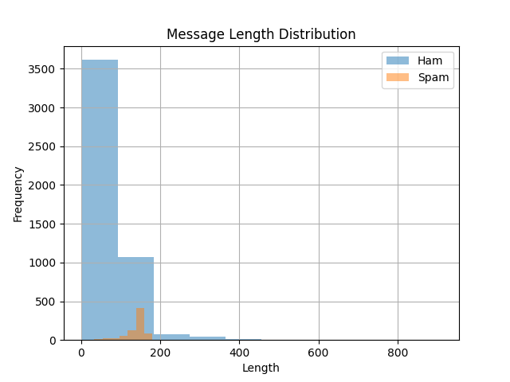
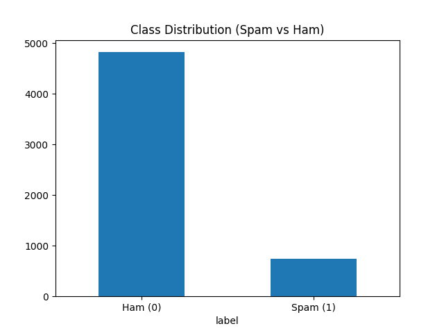
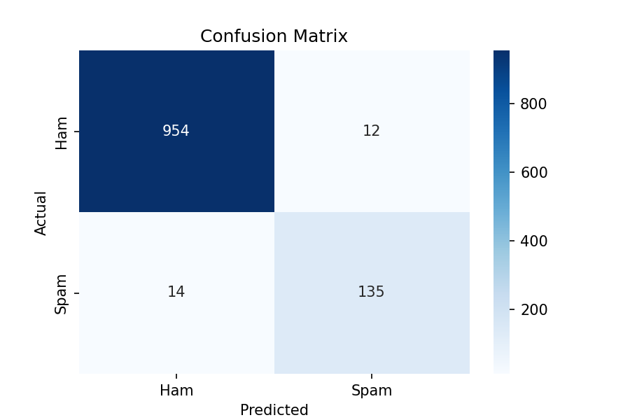

# Spam Email Classifier

## 1. Introduction

This project focuses on building a machine learning model to classify SMS messages as **Spam** or **Ham (legitimate)**. SMS spam is increasingly common, and automatically detecting it helps improve communication efficiency and user experience.

The pipeline includes:

1. **Data Exploration & Cleaning**
2. **Feature Engineering**
3. **Model Training and Hyperparameter Tuning**
4. **Evaluation**
5. **Prediction & Interpretation**

---

## 2. Data Overview

The dataset contains **5,572 SMS messages** with the following composition:

| Label    | Count | Description                  |
| -------- | ----- | ---------------------------- |
| Ham (0)  | 4,825 | Legitimate messages          |
| Spam (1) | 747   | Junk or unsolicited messages |

### 2.1 Message Length Analysis

* Ham messages are mostly short, with a peak between **0–50 characters**, confirming that legitimate messages are brief and conversational.
* Spam messages cluster around **130–160 characters**, as they need to convey offers, links, or incentives.
* Outliers exist for very long Ham messages (up to 900 characters) but are rare.

### 2.2 Word Analysis

**Spam Vocabulary (Top Words):** `free`, `claim`, `prize`, `cash`, `won`, `txt`, `stop`, `reply`, `mobile`, `www`

* Focused on urgency, incentives, and calls to action.

**Ham Vocabulary (Top Words):** `u`, `ok`, `got`, `love`, `time`, `day`, `know`, `come`

* Conversational, relational, and logistical.

**Insight:** Message length and word content are strong distinguishing features between Spam and Ham.

---

## 3. Preprocessing & Feature Engineering

* All text was **lowercased** and **cleaned** by removing punctuation and extra spaces.
* A `clean_text` column was added for consistent processing.
* **Feature Engineering**:

  * **Message Length** (`length`) — serves as a strong differentiator.
  * **TF-IDF Vectorization** — converts text into weighted features.
  * **Bigrams (`ngram_range=(1,2)`)** — captures phrases like "cash prize" instead of single words.

---

## 4. Modeling

* **Classifier:** Logistic Regression (with TF-IDF vectorized input)
* **Hyperparameter Tuning:** Grid search on `C` and `max_features`.
* **Best Parameters:** `{'clf__C': 10, 'tfidf__max_features': 2000}`
* **F1 Score on Test Set:** 0.912

The model effectively distinguishes Spam from Ham while maintaining strong performance on the minority class (Spam).

---

## 5. Evaluation

### 5.1 Confusion Matrix

* **True Negatives (Ham correctly identified):** 954
* **True Positives (Spam correctly identified):** 135
* **False Positives (Ham misclassified as Spam):** 12
* **False Negatives (Spam missed):** 14

### 5.2 Classification Metrics

| Class                | Precision | Recall | F1-score  | Support |
| -------------------- | --------- | ------ | --------- | ------- |
| Ham (0)              | 0.986     | 0.988  | 0.987     | 966     |
| Spam (1)             | 0.918     | 0.906  | 0.912     | 149     |
| **Overall Accuracy** |           |        | **0.977** | 1115    |
| Macro Avg            | 0.952     | 0.947  | 0.949     | 1115    |
| Weighted Avg         | 0.977     | 0.977  | 0.977     | 1115    |

**Insight:**

* Precision for Ham is extremely high (0.986), meaning very few legitimate messages are flagged incorrectly.
* Recall for Spam is also high (0.906), indicating that most spam messages are caught.
* Overall, the model achieves **97.6% accuracy**, which is excellent for a text classification task.

---

## 6. Predictions & Interpretability

Examples of predictions and top contributing words:

1. **Text:** "Congratulations! Claim your free voucher now"
   **Prediction:** Spam
   **Top Words:** `claim (2.70), voucher (1.45), free (1.21), congratulations (0.53)`

2. **Text:** "Hey, can you call me later?"
   **Prediction:** Not Spam
   **Top Words:** `later (-2.23), hey (-2.02)`

3. **Text:** "You have WON 150p, text STOP to unsubscribe"
   **Prediction:** Spam
   **Top Words:** `150p (3.38), stop (1.92), won (1.91), text (1.62), unsubscribe (1.47)`

4. **Text:** "Let's meet for coffee at 5"
   **Prediction:** Not Spam
   **Top Words:** `let (-0.78), coffee (-0.45), meet (0.01)`

**Insight:** The model highlights words that are strong indicators of spam (e.g., `claim`, `free`, `stop`) while down-weighting neutral or legitimate terms.

---

## 7. Conclusion

* **Dataset Analysis:** Spam and Ham messages differ significantly in length and word choice.
* **Feature Engineering:** TF-IDF vectorization with bigrams and message length provides strong predictive power.
* **Model Performance:** Logistic Regression with tuned hyperparameters achieved **97.6% accuracy** and balanced performance for both classes.
* **Practical Value:** The classifier can be deployed to automatically filter SMS messages, minimizing false positives and effectively catching spam.

