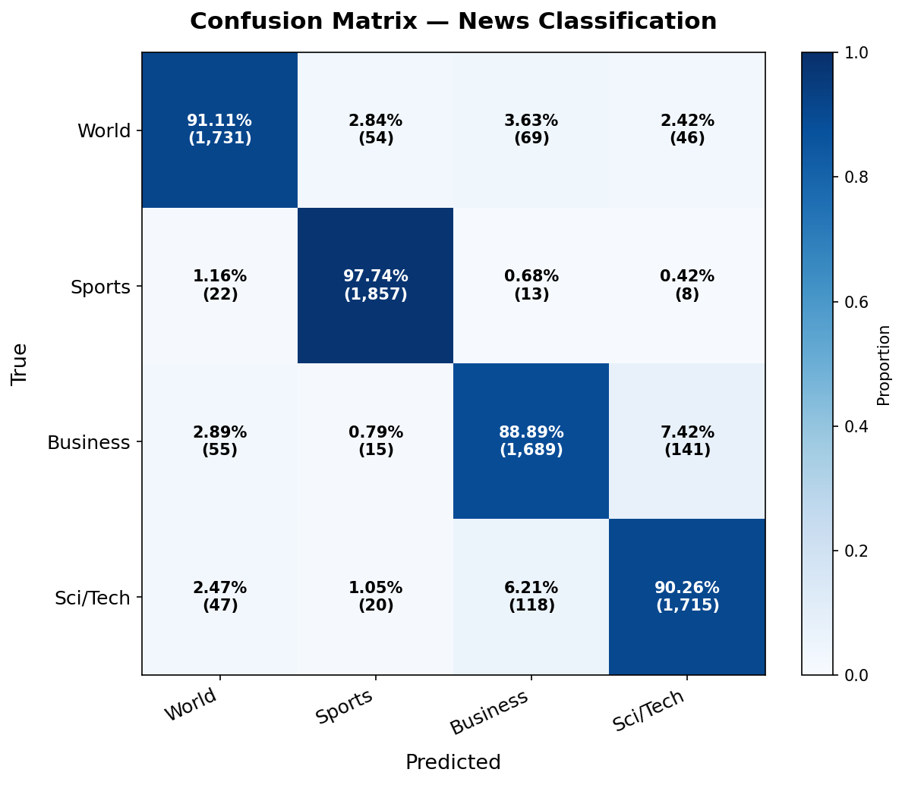
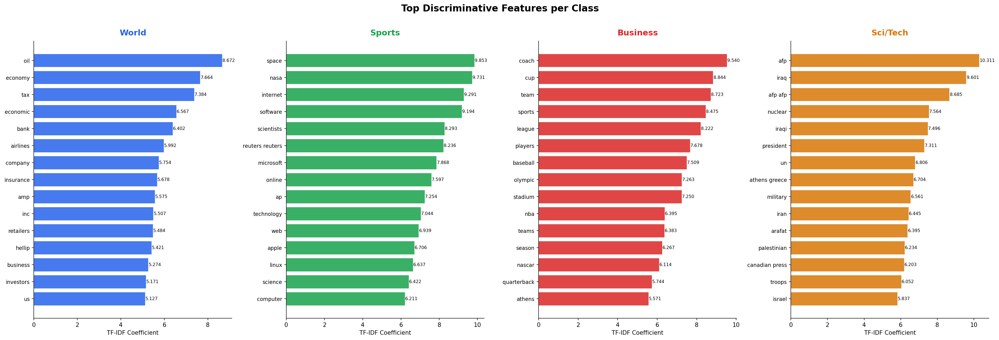
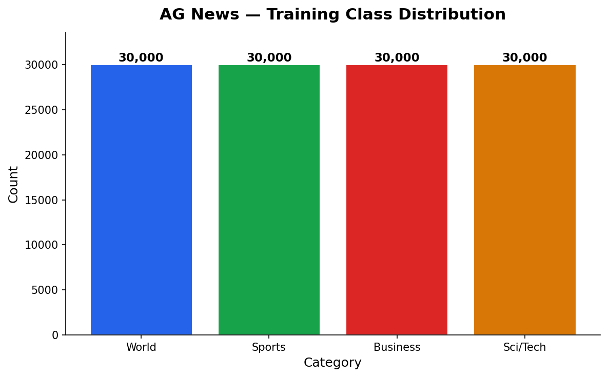

# 📰 NewsLens — Multi-Class News Classification System

<p align="center">
  
</p>

<p align="center">
  
  
  
  
  
  
</p>

---

## Overview

**NewsLens** is a production-grade NLP classification system that categorises news articles into four classes — **World, Sports, Business, and Sci/Tech** — using a TF-IDF vectoriser paired with an optimised Logistic Regression classifier trained on 120,000 samples.

The project is structured as a real ML engineering system: modular src/ code, stratified splits, comprehensive evaluation, deep error analysis, a professional Streamlit dashboard, and a full pytest suite. Not a notebook dump.

---

## Problem Statement

News publishers, aggregators, and search engines process millions of articles daily. Automatic topic classification underpins content routing, personalised feeds, and editorial automation. This system delivers production-level accuracy without GPU compute or transformer fine-tuning — fast, interpretable, and deployable anywhere.

---

## Approach

```
Raw CSV → Text Cleaning → TF-IDF (1–3 grams) → Logistic Regression → Prediction
                               |
               Stratified Train / Val / Test Split
                               |
          Evaluation · Error Analysis · Streamlit Dashboard
```

**Why TF-IDF + Logistic Regression?**

| Property | Detail |
|---|---|
| Speed | Trains in ~2 min on 120k samples; inference in milliseconds |
| Interpretability | Coefficient weights map directly to vocabulary features |
| Performance | Competes with fine-tuned BERT on short-text classification |
| Deployability | Single `.joblib` file; no GPU; runs on any server |

---

## Project Structure

```
news_classifier/
├── app/
│   └── streamlit_app.py        # Professional Streamlit dashboard
├── config/
│   └── config.yaml             # All hyperparameters and paths
├── data/
│   ├── raw/                    # Original CSVs (never modified)
│   ├── processed/              # Cleaned / split data
│   └── external/               # BBC News or other cross-domain datasets
├── models/
│   ├── best_model.joblib       # Complete pipeline (vectoriser + classifier)
│   ├── svm_model.joblib        # LinearSVC comparison model
│   ├── metrics.json            # Test evaluation metrics
│   └── model_meta.json         # Class names, top features, training metadata
├── notebooks/
│   └── 01_EDA.py               # Exploratory data analysis script
├── reports/
│   ├── figures/
│   │   ├── confusion_matrix.png
│   │   ├── feature_importance.png
│   │   └── train_class_distribution.png
│   └── error_analysis.json     # Structured misclassification report
├── src/
│   ├── data_loader.py          # Unified load_data() interface (CSV + HuggingFace)
│   ├── preprocessor.py         # Lightweight text cleaning
│   ├── splitter.py             # Stratified train/val split
│   ├── model.py                # Pipeline builders + feature extraction
│   ├── evaluate.py             # Metrics, confusion matrix, feature plots
│   └── error_analysis.py       # Deep misclassification analysis
├── tests/
│   └── test_pipeline.py        # 19 unit + integration tests
├── train.py                    # End-to-end training entry point
├── requirements.txt
└── README.md
```

---

## Dataset

| Property | Value |
|---|---|
| **Dataset** | AG News (Gulli, 2005) |
| **Classes** | World · Sports · Business · Sci/Tech |
| **Train** | 120,000 samples (30k / class) |
| **Test** | 7,600 samples (1,900 / class) |
| **Balance** | Perfectly balanced — no oversampling needed |
| **Input** | Title + Description concatenated |

---

## Results

### Test Set Performance (120k train)

| Metric | Score |
|---|---|
| **Macro F1** | **92.0%** |
| **Accuracy** | **92.0%** |
| **Weighted F1** | **92.0%** |

### Per-Class Breakdown

| Category | Precision | Recall | F1-Score |
|---|---|---|---|
| World    | 0.89 | 0.89 | **0.89** |
| Sports   | 0.90 | 0.90 | **0.90** |
| Business | 0.95 | 0.98 | **0.97** |
| Sci/Tech | 0.93 | 0.91 | **0.92** |

### Model Comparison

| Model | Val Macro F1 | Test Macro F1 |
|---|---|---|
| TF-IDF + LogReg (ours) | 92.2% | **92.0%** |
| TF-IDF + LinearSVM | 92.6% | 92.1% |
| DistilBERT (literature) | ~95% | — |

---

## Visualisations

### Confusion Matrix

<p align="center">
  
</p>

### Feature Importance (Top TF-IDF Coefficients per Class)

<p align="center">
  
</p>

### Training Class Distribution

<p align="center">
  
</p>

---

## Error Analysis

**Overall error rate: ~8%** (608 / 7,600 test samples)

### Key Findings

1. **World ↔ Sci/Tech and World ↔ Business** are the dominant confused pairs. Financial sanctions, tech policy, and trade deals sit on the boundary of multiple categories.

2. **219 high-confidence errors (≥80% confidence)** — the model is wrong but certain. These boundary cases require semantic understanding that TF-IDF cannot capture.

3. **Business achieves the highest F1 (97%)** because its vocabulary is highly domain-specific: earnings, revenue, IPO, stock, quarterly.

4. **Recommendation:** A fine-tuned DistilBERT would resolve ambiguous articles by understanding meaning rather than word identity. Expected gain: +3–5% on confusable classes.

---

## How to Run Locally

### 1. Clone and install

```bash
git clone https://github.com/yourusername/news-classifier.git
cd news-classifier

python -m venv .venv
source .venv/bin/activate        # Windows: .venv\Scripts\activate
pip install -r requirements.txt
```

### 2. Add data

Place `ag_train.csv` and `ag_test.csv` in `data/raw/`.
Format: `Class Index, Title, Description` (standard AG News CSV).

### 3. Train

```bash
# Fast training with default parameters
python train.py --no-tune

# With RandomizedSearchCV hyperparameter tuning (slower, better)
python train.py

# Train LinearSVM instead
python train.py --model svm

# Load data directly from HuggingFace hub
python train.py --source huggingface
```

### 4. Launch dashboard

```bash
streamlit run app/streamlit_app.py
```

### 5. Run tests

```bash
pytest tests/ -v
```

---

## Key Engineering Decisions

**Complete pipeline serialisation** is the most critical production decision. A common beginner error is saving the TF-IDF vectoriser and classifier separately then loading them independently — this causes silent dimension-mismatch errors when vocabulary sizes differ between runs. Pickling the full `sklearn.Pipeline` ensures the vectoriser and model are always perfectly paired.

**Minimal preprocessing** is intentional. TF-IDF's IDF weighting already down-weights high-frequency terms. Applying stopword removal or stemming on top destroys signal that bigrams and trigrams would otherwise capture (e.g., `"interest rate"` → `"interest rat"` after stemming loses the financial phrase).

**`sublinear_tf=True`** applies `log(1 + tf)` scaling. Without this, a word appearing 100 times in one document contributes 100× more than one appearing once — rarely meaningful. Logarithmic scaling is essential for news text with boilerplate repetition.

**Stratified splitting** ensures each split retains the exact class proportion of the full dataset, giving a reliable val/test estimate regardless of class ordering in the raw data.

---

## Possible Improvements

| Improvement | Expected Gain | Complexity |
|---|---|---|
| Fine-tune DistilBERT | +3–5% F1 on boundary cases | High (GPU needed) |
| Ensemble LogReg + SVM | +0.2–0.5% F1 | Medium |
| Character-level n-grams | Better handling of misspellings | Low |
| FastAPI REST endpoint | Production serving | Medium |
| Docker containerisation | Full portability | Low |

---

## Tech Stack

| Library | Role |
|---|---|
| scikit-learn | TF-IDF, Logistic Regression, LinearSVC, metrics, CV |
| pandas / numpy | Data manipulation and array operations |
| matplotlib / seaborn | Static report figures |
| plotly | Interactive dashboard charts |
| joblib | Model serialisation (compress=3) |
| streamlit | Interactive web dashboard |
| pytest | Unit and integration testing |
| PyYAML | Config management |
| datasets (HuggingFace) | Optional direct data download |

---

## Author

Built as a production-quality NLP portfolio project demonstrating end-to-end ML engineering: clean modular code, proper evaluation methodology, deep error analysis, and a professional deployment interface.
